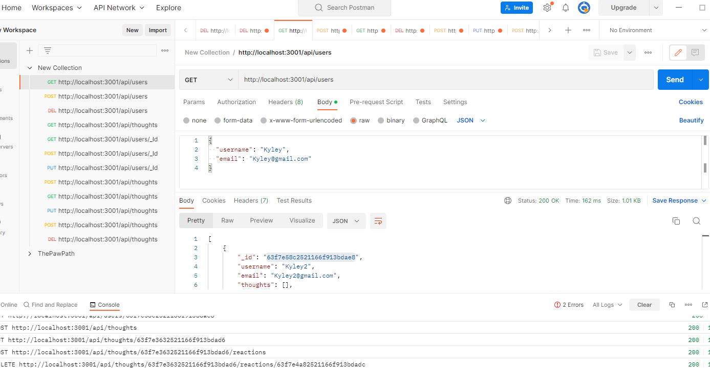

# SocialN
An API that simulates a Social Network

# Table of Contents
1. [Title: Tech Blog for people to stay up to date on the lastest tech news.](#title)
2. [Description/Problem Solved](#description)
3. [Installation](#installation)
4. [License and Link: ](#license)
5. [Credit](#credit)
6. [Installation Steps](#installation-steps)
7. [Intended Usage](#intended-usage)
8. [Tests?](#Tests)
9. [Questions?](#questions)

  Or watch on youtube - https://www.youtube.com/watch?v=Udmtc3UUVoI

# The Social Network API Project
## Description/Problem Solved 
Routes to Users, Friends, Thoughts and Reactions
## Installation 
MongoDb, mongoose, express
## License and Link: [MIT](https://opensource.org/licenses/MIT/)

## Credit 
Chrysti Reichert
## Installation Steps 
npm Install then nodemon start 
## Intended Usage 
Intended for all
## Tests? 
 
## Questions? 
 momchrysti@gmail.com
